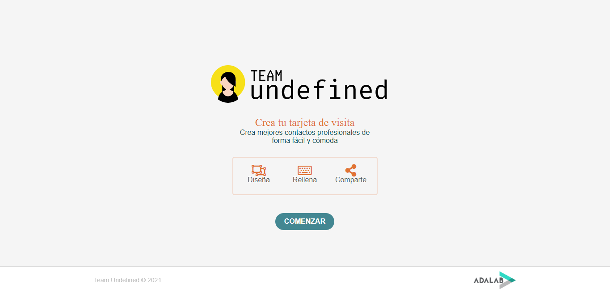
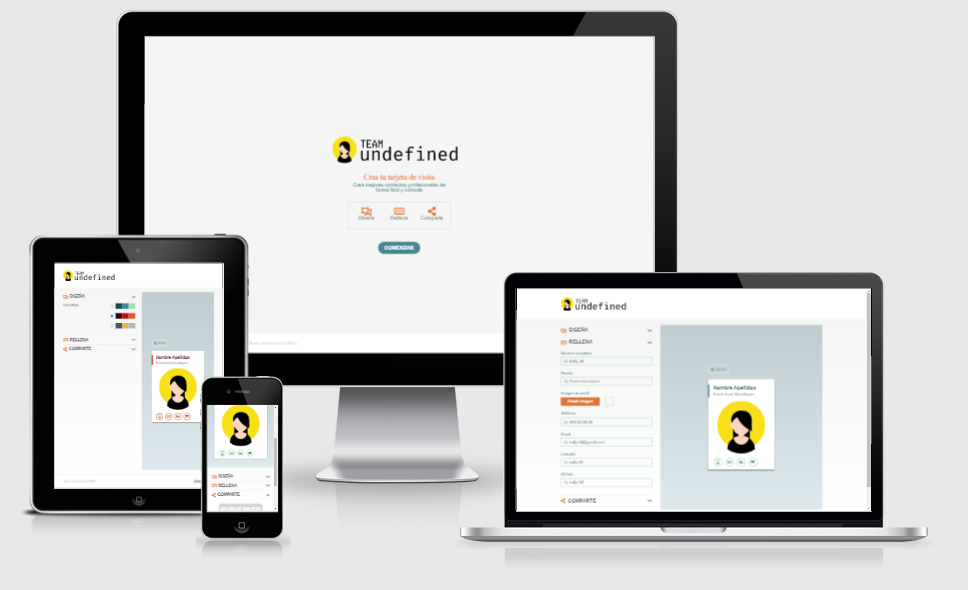

<h1 align="left">Awesome Profile Cards</h1>

<h2 align="left">Índice</h2>
<h3 align="left">1. Introducción</h3>
<h3 align="left">2. Descripción</h3>
<h3 align="left">3. Historias de usuario</h3>
<h3 align="left">4. Miembros del equipo</h3>

---

<h3 align="left">1. Introducción</h3>

En este proyecto hemos trabajado con un código heredado realizado con JavaScript y hemos hecho una migración del mismo a React. Asimismo hemos desarrollado un servidor web y trabajado con nuestra propia base de datos.
Los objetivos principales de este proyecto eran por tanto, por un lado, lidiar con código heredado y ser capaces de refactorizarlo, así como saber identificar y generar los componentes de una página, separarlos y crear componentes visualmente similares a partir de estos, y por otro lado, trabajar con servidores y bases de datos.

---

<h3 align="left">2. Descripción</h3>

La página web consiste en:

1. Una landing page.
2. Una página de creación de la tarjeta.

Ambas páginas tienen un diseño responsive:

- 
<strong>Móvil, menor de 768px</strong>

- 
<strong>Tablet, entre 768px y 1200px</strong>

- 
<strong>Desktop, a partir de 1200px</strong>

---

- <h4 align="left">Tecnologías utilizadas:</h4>

        

- <h4 align="left">Especificaciones</h4>

  - 
Uso de Sass para los estilos

  - 
Uso de mediaqueries para que el diseño sea adaptable al dispositivo

  - 
Desarrollo usando la estrategia mobile first

  - 
Uso de git para el control de versiones del proyecto, con ramas y pull-requests

  - 
Publicación del resultado en Internet usando GitHub Pages

  - 
Uso de React para la estructuración del JS de la aplicación

  - 
Transiciones y/o animaciones para mejorar interacciones con la aplicación

  - 
Navegación entre distintas páginas de la aplicación usando React router

  - 
Creación de una base de datos de tarjetas

  - 
Utilización de un motor de plantillas

  - 
Trabajo con servidor de estáticos

  - 
Trabajo con servidor de producción

---

<h3 align="left">3. Historias de usuario</h3>

- <h3>Migración a react</h3>

  - **Primer paso. Análisis del proyecto**

  - **Segundo paso. Maquetación con React de la página de la herramienta**

  - **Tercer paso. Versión completa con React**

  - **Cuarto paso. Mejoras finales**

- <h3>Servidores</h3>

  - **Primer paso. API**

  - **Segundo paso. Servidor de estáticos**

  - **Tercer paso. Motor de plantillas**

  - **Cuarto paso. Bases de datos**

---

<h3 align="left">4. Miembros del equipo</h3>

[Alejandra Mejía](https://github.com/AlejandraMejiaP)

[Claudia Berrocal](https://github.com/claudiabg-c)

[Macarena Peña](https://github.com/mpenacasares)

[Silvia Días](https://github.com/SilviaDimol)

[Denise Overbeck](https://github.com/denisetroglio)
